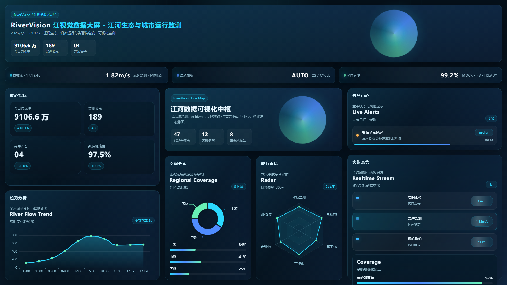

# RiverVision 自动化截图能力提示词

> 使用前请先阅读并理解项目核心文件，确保改动建立在当前代码结构之上。

你是一名资深前端工程师、Playwright 自动化测试专家和开源项目维护者。

你现在在一个 React 19 + TypeScript + ECharts 数据大屏项目中工作。

项目英文名：RiverVision
项目中文名：江视觉数据大屏

项目定位：
这是一个面向学生和初学者的教学型数据大屏项目，目标是帮助用户从 0 到 1 学会如何制作一个完整的数据可视化大屏。

本次任务目标：
为项目增加一套可重复执行的自动化截图能力，把数据大屏页面自动截图保存到指定目录，方便 README 展示、课程资料引用、多 AI 协作验收和视觉检查。

请直接执行，不要只给我方案。

---

## 一、目录约定

1. 项目展示截图统一保存到：

```text
docs/screenshots/
```

2. 默认主图文件名为：

```text
docs/screenshots/dashboard-1920x1080.png
```

3. 如果需要保存调试截图、临时截图、带时间戳截图或自动化运行产物，可以保存到：

```text
artifacts/screenshots/
```

4. `docs/screenshots/` 下的主图是项目展示资产，可以提交 Git，用于 README、GitHub 项目首页、课程讲义和文章配图。

5. `artifacts/` 是自动化运行产物，默认不要提交 Git；如项目中尚未忽略该目录，请加入 `.gitignore`。

---

## 二、重要端口约定

当前项目开发服务端口已经统一改为 **10001**。

请使用：

```text
http://127.0.0.1:10001/
```

不要使用旧的 Vite 默认端口 5173，也不要改成 5310。

---

## 三、核心原则

1. **不引入复杂新依赖**。优先复用项目已有的 Playwright（`@playwright/test`）。
2. **截图脚本必须可以通过 npm scripts 一键执行**。
3. **截图前必须等待页面和图表渲染完成**。
4. **截图前应等待实时数据至少刷新一轮**。（当前项目已实现 2s 轮询实时模拟器）
5. **截图时必须检查浏览器控制台 error**。
6. **如果有 console error，仍然保存截图，但命令应返回失败并打印错误信息**。
7. **截图脚本要适合教学讲解，代码清晰，不要过度封装**。
8. **不要把截图逻辑塞进业务组件**。
9. **不要破坏现有 E2E 测试**。
10. **不要使用 `git reset --hard`、`git checkout -- .` 等破坏性命令**。
11. **如果发现已有未提交改动，请先阅读并理解，不要随意回滚用户已有改动**。

---

## 四、你需要先阅读并理解以下文件

**特别强调：以下文件名和路径必须与实际项目完全一致。如果路径不对，请先用 Glob / Bash 找到实际路径。**

- `package.json`
- `playwright.config.ts`
- `tests/e2e/dashboard.spec.ts`
- `src/pages/dashboard/ui/dashboard-page.tsx`
- `src/widgets/hero-banner/ui/hero-banner.tsx`
- `src/widgets/trend-chart/ui/trend-chart.tsx`
- `src/widgets/distribution-chart/ui/distribution-chart.tsx`
- `src/widgets/alerts-panel/ui/alerts-panel.tsx`
- `src/widgets/realtime-panel/ui/realtime-panel.tsx`
- `src/widgets/radar-chart/ui/radar-chart.tsx`
- `src/entities/dashboard/model/types.ts`
- `.gitignore`

---

## 五、推荐实现方式

### 5.1 新增独立截图脚本

新建文件：

```text
scripts/capture-dashboard.mjs
```

不要把它写进 E2E 测试文件里。E2E 测试负责验收，截图脚本负责生成展示资产。

### 5.2 package.json 中新增脚本

在 `package.json` 的 `scripts` 段中新增：

```json
"screenshot": "node scripts/capture-dashboard.mjs"
```

如果需要，也可以增加更明确的脚本名：

```json
"screenshot:dashboard": "node scripts/capture-dashboard.mjs"
```

---

## 六、截图脚本行为要求

脚本行为应严格遵循以下流程：

### 6.1 自动创建目录

自动创建：

```text
docs/screenshots/
```

如果 `artifacts/` 目录不存在也一并创建。

### 6.2 默认访问地址

```text
http://127.0.0.1:10001/
```

### 6.3 设置浏览器 viewport

```text
1920x1080
```

### 6.4 等待页面标题出现

等待页面中的标题元素可见，例如：

- `RiverVision`
- `江视觉数据大屏`
- 或根据当前页面实际标题等待对应 heading

### 6.5 等待核心大屏内容出现

确认以下内容已经渲染：

- 指标卡片（`.metric-grid` 或 `核心指标`）
- 大屏标题区域（`HeroBanner` / `江河数据可视化中枢`）
- 图表容器（`trend-chart`、`distribution-chart`、`radar-chart` 等）

### 6.6 等待实时数据刷新

等待 **3 到 5 秒**，让 ECharts 和模拟实时数据刷新至少一轮。

### 6.7 检查页面是否有明显加载失败状态

检查是否存在 loading 骨架屏、错误提示等非正常状态。

### 6.8 收集浏览器 console error

使用 Playwright 的 `page.on('console', ...)` 收集所有 `error` 级别的控制台日志。

### 6.9 截图保存

保存到：

```text
docs/screenshots/dashboard-1920x1080.png
```

截图应使用当前视口截图，不要截成长图。

### 6.10 推荐 Playwright 截图参数

```ts
await page.screenshot({
  path: 'docs/screenshots/dashboard-1920x1080.png',
  fullPage: false,
});
```

### 6.11 输出截图路径

截图完成后，在终端输出截图路径。

### 6.12 错误处理

如果存在 console error：

- 打印错误列表。
- 保留已经生成的截图。
- 使用非 0 exit code 退出。

如果没有 console error：

- 打印成功信息。
- 使用 0 exit code 退出。

---

## 七、开发服务处理要求

### 7.1 推荐方式

截图脚本默认认为开发服务已经在 10001 端口启动。

### 7.2 未启动处理

如果没有启动，脚本应给出明确提示，例如：

```text
请先运行 npm run dev -- --host 127.0.0.1 --port 10001
```

### 7.3 不要自动启动服务

不要在第一版截图脚本里强行同时负责启动 dev server，避免进程管理复杂。

如后续需要，可以再扩展为自动启动服务版本。

---

## 八、推荐命令流程

先启动项目：

```bash
npm run dev -- --host 127.0.0.1 --port 10001
```

再执行截图：

```bash
npm run screenshot
```

或：

```bash
npm run screenshot:dashboard
```

---

## 九、截图资产要求

1. **主图固定覆盖保存**：

```text
docs/screenshots/dashboard-1920x1080.png
```

2. **不要每次都在 `docs/screenshots/` 生成一堆时间戳图片**，避免仓库膨胀。

3. 如果确实需要时间戳截图，请放到：

```text
artifacts/screenshots/
```

4. 如果新增 `artifacts/`，请确保 `.gitignore` 忽略：

```text
artifacts/
```

5. **不要忽略 `docs/screenshots/`**，因为主图需要作为项目展示资产提交。

---

## 十、README 可选增强

如果 README 当前还没有展示截图，可以在 README 中增加一节：

```md
## 项目截图


```

如果 README 已有类似内容，请不要重复添加。

如果用户没有明确要求更新 README，可以只生成截图脚本和截图文件，不强制改 README。

---

## 十一、视觉验收要求

截图生成后请实际检查截图文件是否存在，并确认文件大小大于 0。

建议使用命令：

```bash
ls -lh docs/screenshots/dashboard-1920x1080.png
```

也可以使用浏览器或图片查看工具确认截图不是空白。

如果可用，请打开或读取截图进行视觉检查，确认：

- 页面不是空白。
- 标题显示正常。
- 指标卡片显示正常。
- 如意数据中枢显示正常。
- 图表区域不是空白。
- 页面没有明显布局重叠。
- 页面没有滚动条。
- 截图是 1920x1080 视口效果。

---

## 十二、验证要求

完成后请至少运行：

```bash
npm run screenshot
```

如果你修改了 `package.json`、脚本或测试相关文件，也请运行：

```bash
npm run lint
npm run test
npm run build
```

如果 E2E 环境可用，也运行：

```bash
npm run test:e2e
```

如果验证失败：

1. 先阅读错误原因。
2. 只做必要修复。
3. 修复后重新运行失败的验证命令。
4. 不要绕过 lint、test、build 或截图验证。

---

## 十三、验收标准

1. 新增自动化截图脚本。
2. `package.json` 中可以通过 npm script 一键截图。
3. 默认截图地址为 `http://127.0.0.1:10001/`。
4. 默认截图尺寸为 1920x1080。
5. 默认截图输出到 `docs/screenshots/dashboard-1920x1080.png`。
6. `docs/screenshots/` 会自动创建。
7. 截图前会等待页面核心内容和图表渲染。
8. 截图前会等待实时数据刷新一轮。
9. 会收集 console error。
10. console error 会导致命令失败，但截图仍保留。
11. 截图文件存在且不是空文件。
12. 不使用 5173 或 5310 端口。
13. 不破坏现有 E2E 测试。
14. 不提交或污染 `artifacts/` 临时产物。

---

## 十四、最终交付说明

完成后请告诉我：

- **新增或修改了哪些文件**（精确路径）。
- **截图脚本路径**。
- **package.json 新增了哪些命令**。
- **截图保存目录**。
- **主图文件路径**。
- **使用的访问地址和端口**。
- **使用的截图尺寸**。
- **是否检查了 console error**。
- **已运行的验证命令和结果**。
- **截图文件是否已生成**。
- **是否存在未完成事项**。

---

## 附：RiverVision 项目当前技术栈速查

- **框架**：React 19 + TypeScript 5.9
- **构建工具**：Vite 7.1
- **状态管理**：Zustand 5（当前主要用 useState）
- **图表库**：ECharts 5.6
- **测试**：Vitest + React Testing Library
- **E2E**：Playwright（已配置，端口 10001）
- **代码规范**：ESLint + Prettier
- **路径别名**：`@` = `src/`

---

## 附：当前 Dashboard 页面核心元素选择器参考

根据当前 `src/pages/dashboard/ui/dashboard-page.tsx`：

- **标题**：`HeroBanner` 组件，包含 "RiverVision" / "江视觉数据大屏"
- **指标卡片**：`.metric-grid` 内的 `MetricCard` 组件
- **如意数据中枢**：`.hero-map` / `.hero-banner` 内的 "江河数据可视化中枢"
- **趋势图**：`TrendChart` 组件，容器 `trend-chart`
- **分布图**：`DistributionChart` 组件，容器 `distribution-chart`
- **雷达图**：`RadarChart` 组件，容器 `radar-chart`
- **告警中心**：`AlertsPanel` 组件，`alert-carousel`
- **实时态势**：`RealtimePanel` 组件

---

## 附：当前 E2E 测试文件参考

`tests/e2e/dashboard.spec.ts` 已包含：

- 页面标题可见断言
- 控制台 error 收集
- 等待 5 秒让实时数据刷新
- 截图保存（可选）

截图脚本可以复用其中的等待策略和 console error 收集逻辑，但请保持脚本独立。
